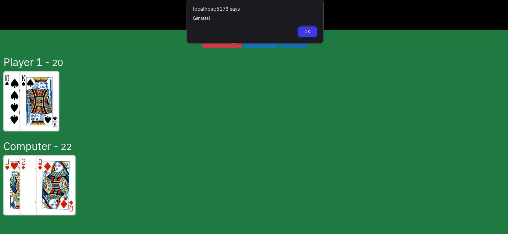

# Blackjack

Este mini proyecto, es un repaso de mis habilidades con JS.

Temas aplicados:

- Modulos con JavaScript (individuales / por defecto)
- Documentacion de funciones con JSDoc
- Uso de un linter (standard)

